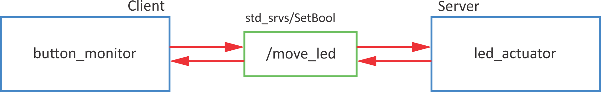

# Introduction to ROS

Welcome to the ROS FE workshop. In this part of the workshop you will learn the fundamentals of ROS.

## Why ROS?

Why, oh why????

## ROS setup

### roscore
- takes care of communicaiton between different ROS functionalities
- it can run only one at once
- connects different ROS system into one ROS network

```python
roscore
```

### catkin workspace

CATKIN is an official build system for ROS

```
cd
mkdir catkin_ws
cd catkin_ws
mkdir src
catkin_make
```

Alternative is to use `catkin build` (beforehand you need to remove devel and build folders).

Conect console with ROS variables
```
cd devel
source setup.bash
```

To do this automatically when the console is opened, add to `bashrc.sh`
```
echo "source ~/catkin_ws/devel/setup.bash" >> ~/.bashrc
source ~/.bashrc
```

## Packages

Packages are independent units, that can be re-used.

### New package

Go to `catkin_ws/src/` folder.

Basic syntax:
```
catkin_create_pkg <package_name> [depend1] [depend2] [depend3]
```

Create new package `rpi_feros`:

```
cd ~/catkin_ws/src
catkin_create_pkg rpi_feros rospy std_msgs actionlib_msgs
catkin_make
```

## Node
Nodes are processes:
- used for calculations,
- that run inside robotic application,
- grouped into packages,
- that communicate with each other (topics, servers, actions, parameter servers). 

Why to use nodes:
- reduce code complexity,
- the code is more error-resistant,
- use of different programming languages.

### New node

Nodes are scripts that are located inside `scripts` folder.
```
roscd rpi_feros
mkdir scripts
cd scripts
```
Create new script `my_first_node.py`:
```
touch my_first_node.py
```

Change the access permissions of the file to executable:
```
chmod +x my_first_node.py
```

Open script with Visual Studio Code:
```
code my_first_node.py
```

The minimal working example for node:

```python linenums="1" title="my_fist_node.py"
#!/usr/bin/env python

import rospy

if __name__ == '__main__':
  rospy.init_node('my_first_python_node')
  rospy.loginfo('This node has been started.')
  rospy.sleep(1)
  print('Exit now')
```

Only one node with specific name can be run at a time. If you want to run more instances of the same node, change:
```python linenums="6"
  rospy.init_node('my_first_python_node', anonymous=True)
```

To run, write
```
python my_first_node.py
```

### New node - class

```python linenums="1" title="my_fist_node_class.py"
#!/usr/bin/env python

import rospy

class hello_world():
    
  def __init__(self):
    # init variables
    self.delay = 5
    self.ctrl_c = False
    rospy.on_shutdown(self.shutdownhook)
        
  def shutdownhook(self):
    # works better than the rospy.is_shutdown()
    # this code is run at ctrl + c
    rospy.loginfo('This node has been terminated.')
    self.ctrl_c = True
  
  def test_node(self): 
    rospy.loginfo('This node has been started.')
    rospy.sleep(self.delay)
    print('Exit now')
            
if __name__ == '__main__':
  # initialise node
  rospy.init_node('my_first_python_node')
  # initialise class
  first_node = hello_world()
  try:
    first_node.test_node()
  except rospy.ROSInterruptException:
    pass
```


### DEBUG

- `rosrun <pkg name> <node name>` - run specific node
- `rosnode list` - list of all active nodes
- `rosnode info <node name>` - information about hte node
- `rosnode kill <node name>` - shut down node
- `rosnode ping <node name>` - ping node (check, if it is working)


## Topics

Topic is:
- a communication channel through which nodes exchange messages
- one-way messaging (publisher> subscriber)
- anonymous
- topic has its own message type ([list of standars message types](http://wiki.ros.org/std_msgs))
- ROS master takes care of the proper publisher/subscriber connection
- each node can have multiple publishers/subscribers for different topics

### Example

Turn on LED on button press.


#### Publisher

Syntax for publisher:
```python
pub = rospy.Publisher('/topic_name', msg_type, queue_size=10)
```

Example code:

```python linenums="1" title="button_publisher.py"
#!/usr/bin/env python

import rospy
import RPi.GPIO as GPIO
from std_msgs.msg import Bool

# buttons GPIO pins 
#   button 1 - gpio 11
#   button 2 - gpio 12

class rpi_button():
    
    def __init__(self):
        # init variables
        self.BUTTON_GPIO = 11
        # set GPIO kot BCM
        GPIO.setmode(GPIO.BCM)
        # set button IO as input
        GPIO.setup(self.BUTTON_GPIO, GPIO.IN)
        # set loop frequency to 10 Hz
        self.rate = rospy.Rate(10)
   
        # define publisher
        # rospy.Publisher("topic_name", varType, queue_size)
        self.pub = rospy.Publisher('/button_state', Bool, queue_size=10)

        self.ctrl_c = False
        rospy.on_shutdown(self.shutdownhook)

    def read_button(self):
        while not self.ctrl_c:
            #  read GPIO pin
            gpio_state = GPIO.input(self.BUTTON_GPIO)
            # define msg as Bool variable
            self.msg = Bool()
            # msg has a data "data"
            self.msg.data = gpio_state
            # send msg
            self.publish_once()
    
    def publish_once(self):
        """
        This is because publishing in topics sometimes fails the first time you publish.
        In continuous publishing systems, this is no big deal, but in systems that publish only
        once, it IS very important.
        """
        while not self.ctrl_c:
            connections = self.pub.get_num_connections()
            if connections > 0:
                self.pub.publish(self.msg)
                #rospy.loginfo("Msg Published")
                break
            else:
                self.rate.sleep()
       
    def shutdownhook(self):
        # works better than the rospy.is_shutdown()
        # this code is run at ctrl + c

        # clear all GPIO settings
        GPIO.cleanup()
        self.ctrl_c = True
            
if __name__ == '__main__':
    # initialise node
    rospy.init_node('button_state_publisher', anonymous=True)

    # initialise class
    btn = rpi_button()
    try:
        btn.read_button()
    except rospy.ROSInterruptException:
        pass
```

To test the code run
```
rosrun rpi_feros button_publisher.py
```
check the list of topics (look for `/button_state`)
```
rostopic list
```
Then listen to that topic
```
rostopic echo /button_state -c
```
and press the button on RaspberryPi.

#### Subscriber

Syntax for subscriber:
```python
sub = rospy.Subscriber('/topic_name', msg_type, callback_fcn)
```
Example code:
```python linenums="1" title="led_actuator.py"
#!/usr/bin/env python

import rospy
from std_msgs.msg import Bool
import RPi.GPIO as GPIO

# GPIO za LED:
#   Green 1 - GPIO 2
#   Green 2 - GPIO 3
#   Yellow 1 - GPIO 4
#   Yellow 2 - GPIO 5
#   Red 1 - GPIO 6
#   Red 2 - GPIO 7

class rpi_led():
    
    def __init__(self):
        # init variables
        self.LED_GPIO = 7
        # set GPIO kot BCM
        GPIO.setmode(GPIO.BCM)
        # set all leds
        for ii in range(2,8):
            # set IO as outputs
            GPIO.setup(ii,GPIO.OUT)
        
        # define subscriber
        # rospy.Subscriber('topic_name', varType, callback)
        self.sub = rospy.Subscriber('/button_state', Bool, self.button_state_callback)

        self.ctrl_c = False
        rospy.on_shutdown(self.shutdownhook)

    def button_state_callback(self, msg):
        # the code that is executed when data is received
        # turn on LED
        GPIO.output(self.LED_GPIO, msg.data)

    def resetLed(self):
        # reset all leds
        for ii in range(2,8):
            # turn off all leds
            GPIO.output(ii,False)
        
    def shutdownhook(self):
        # works better than the rospy.is_shutdown()
        # this code is run at ctrl + c

        # clear all settings
        GPIO.cleanup()
        self.ctrl_c = True
            
if __name__ == '__main__':
    # initialise node
    rospy.init_node('led_actuator')
    # initialise class
    led_act = rpi_led()
    # reset leds
    led_act.resetLed()
    try:
        # loop
        rospy.spin()
    except rospy.ROSInterruptException:
        pass
```
 
To test the code run
```
rosrun rpi_feros led_actuator.py
```

After that check topics (loook for `/button_state`):
```
rostopic list
```

Use `rostopic pub` to turn LED on and off:
```
rostopic pub /button_state std_msgs/Bool "data: True"
rostopic pub /button_state std_msgs/Bool "data: False"
```


To test both (publisher and subscriber), run each in  the invidual terminal:
```
rosrun rpi_feros button_publisher.py
```
and
```
rosrun rpi_feros led_actuator.py
```
When pressing the button on RPi, the LED should turn on.

### DEBUG

- `rostopic -h` - rostopic help
- `rostopic list` - list of all active topics
- `rostopic echo <topic name>` - listen to selected topic
  * `-c` - clear output each time
  * `-n2` - print only 2 outputs
- `rostopic info <topic name>` - information about topic
- `rostopic pub <topic name>` + `Tab` for autocomplete - publish data
  * `-1` - publish only once
  * `-r5`- publish with 5 Hz


### Exercise

Turn on LED if the object is closer than 0.2 m.


## Services
- Server/client system
- Synchronous operation
- For calculation and quick actions
- One message type for Request, another message type for Response
- A server is only one that can respond to multiple clients

### Example

Turn on LED on button press using interrupts.


#### Server

Syntax for service server:
```python
service = rospy.Service('/service_name', msg_type, handle_fcn)
```

Example code:

```python linenums="1" title="led_service_server.py"
#!/usr/bin/env python

import rospy
from std_srvs.srv import SetBool
import RPi.GPIO as GPIO

class ledServer():
    
    def __init__(self):
        # init variables
        self.LED_GPIO = 2
        # set GPIO kot BCM
        GPIO.setmode(GPIO.BCM)
        # set all leds
        for ii in range(2,8):
            # set IO as outputs
            GPIO.setup(ii,GPIO.OUT)
        
        # define service
        # rospy.Service('service_name',varType,callback)
        rospy.Service('/set_led_state', SetBool, self.set_led_status_callback)
        rospy.loginfo("Service server started. Ready to get request.")

        self.ctrl_c = False
        rospy.on_shutdown(self.shutdownhook)

    def set_led_status_callback(self, req): 
        # code that is executed when request is received
        # set LED to req.data
        GPIO.output(self.LED_GPIO, req.data)
        # server response
        return {'success': True, 'message':'Successfully changed LED state.'}

    def resetLed(self):
        # reset all leds
        for ii in range(2,8):
            # turn off all leds
            GPIO.output(ii,False)
        
    def shutdownhook(self):
        # works better than the rospy.is_shutdown()
        # this code is run at ctrl + c

        # clear all settings
        GPIO.cleanup()
        self.ctrl_c = True
            
if __name__ == '__main__':
    # initialise node
    rospy.init_node('led_actuator')
    # initialise class
    led_server = ledServer()
    # reset leds
    led_server.resetLed()
    try:
        # loop
        rospy.spin()
    except rospy.ROSInterruptException:
        pass
```

To test the code run
```
rosrun rpi_feros led_service_server.py 
```
and check the list of services (look for `/set_led_state`)
```
rosservice list
```
Use `rosservice call` to test the server
```
rosservice call /set_led_state "data: True"
rosservice call /set_led_state "data: False" 
```


### Client

Syntax for service proxy (client):
```python linenums="1"
rospy.wait_for_service('/service_name')

try:
  client = rospy.ServiceProxy('/service_name',msg_type)
  ...
except rospy.ServiceException as e:
  rospy.logwarn('Service failed' + str(e))
```

Example:
```python linenums="1" title="button_service_client.py"
#!/usr/bin/env python

import rospy
from std_srvs.srv import SetBool
import RPi.GPIO as GPIO

class buttonClient():
    
    def __init__(self):
        # init variables
        self.BUTTON_GPIO = 11
        self.LED_STATE = False
        # set GPIO kot BCM
        GPIO.setmode(GPIO.BCM)
        # set button GPIO as input
        GPIO.setup(self.BUTTON_GPIO, GPIO.IN)
        # set interrupt
        # GPIO.add_event_detect(gpio_num, edge, callback, bouncetime)
        GPIO.add_event_detect(self.BUTTON_GPIO, GPIO.RISING, callback=self.button_callback, bouncetime=500)

        # define service proxy
        # rospy.ServiceProxy('service_name', varType)
        # wait for service
        rospy.wait_for_service('/set_led_state')
        # define proxy 
        self.set_led_state = rospy.ServiceProxy('/set_led_state', SetBool)
        
        self.ctrl_c = False
        rospy.on_shutdown(self.shutdownhook)

    def button_callback(self, channel):
        # code that is called from interrupt
        # get the button state
        power_on_led = GPIO.input(self.BUTTON_GPIO)

        # change LED state
        self.LED_STATE = not self.LED_STATE

        try:
            # send request, get response
            resp = self.set_led_state(self.LED_STATE)
            # print response
            print(resp)
        except rospy.ServiceException as e:
            # in case of error
            rospy.logwarn(e)
        
    def shutdownhook(self):
        # works better than the rospy.is_shutdown()
        # this code is run at ctrl + c

        # clear all settings
        GPIO.cleanup()
        self.ctrl_c = True
            
if __name__ == '__main__':
    # initialise node
    rospy.init_node('button_monitor')
    # initialise class
    button_client = buttonClient()
    try:
        # loop
        rospy.spin()
    except rospy.ROSInterruptException:
        pass
```

To test, run both server and client in seperate terminals
```
rosrun rpi_feros led_service_server.py 
rosrun rpi_feros button_service_client.py
```
With a button press, LED should turn on and off.

### DEBUG

- `rosservice list` - list of all active services
- `rosservice info <service name>` - information about the selected service
- `rosservice call <service name>` - request to service server from the console

### Exercise

Use buttons to shift active LED left or right.




## Custom messages

Topics messages: `.msg`

Service messages: `.srv`

Service message has two parts
```
Request msg
---
Response msg
```

Use of `msg` primitives to define custom messages.

MSG:
- std_msgs
- sensor_msgs
- geometry_msgs
- actionlib_msgs
- ...

SRV:
- std_srvs
- ...

### MSG

We will create new topic message `ledStatus` composed of
```
int64 ledNumber
string ledStatus
```
Create new package `rpi_msgs`
```
cd ~/catkin_ws/src
catkin_create_pkg rpi_msgs rospy std_msgs
```
and build it
```
roscd
cd ..
catkin_make
```
Go to the package and create new folder `msg`:
```
roscd rpi_msgs
mkdir msg
cd msg
```

Create new file `ledStatus.msg`
```
touch ledStatus.msg
code ledStatus.msg
```
and copy the following lines:
``` linenums="1"
int64 ledNumber
string ledStatus
```


Open `package.xml` in `rpi_msgs` package
```
code package.xml
```
and add the following lines
```xml title="package.xml" linenums="58"
<build_depend>message_generation</build_depend>
<exec_depend>message_runtime</exec_depend>
```

Open `CMakeLists.txt` in `rpi_msgs` package
```
code CMakeLists.txt
```
and add the following lines
```txt title="CMakeLists.txt" hl_lines="4" linenums="10"
find_package(catkin REQUIRED COMPONENTS
  rospy
  std_msgs
  message_generation
)
```

```txt title="CMakeLists.txt" hl_lines="4" linenums="49"
# Generate messages in the 'msg' folder
add_message_files(
  FILES
  ledStatus.msg
)
```

```txt title="CMakeLists.txt" linenums="69"
# Generate added messages and services with any dependencies listed here
generate_messages(
  DEPENDENCIES
  std_msgs
)
```

```txt title="CMakeLists.txt" hl_lines="4" linenums="104"
catkin_package(
  # INCLUDE_DIRS include
  # LIBRARIES my_robot_msgs
  CATKIN_DEPENDS rospy std_msgs message_runtime
  # DEPENDS system_lib
)
```

After that do `catkin_make`
```
roscd
cd ..
catkin_make
```

After the build is finish you can check if the message `rpi_msgs/ledStatus` is available
```
rosmsg list |grep rpi
```

### SRV

We will create new service message `safetyZone.srv` composed of
```
int16 zone
---
bool success
string message
```

Go to the package `rpi_msgs`
```
roscd rpi_msgs
```
and create new folder `srv`:
```
mkdir srv
cd msg
```

Create new file `safetyZone.srv`
```
touch safetyZone.srv
code safetyZone.srv
```
and copy the following lines:
``` linenums="1"
int16 zone
---
bool success
string message
```

Open `CMakeLists.txt` in `rpi_msgs` package
```
code CMakeLists.txt
```
and add the following lines
```txt title="CMakeLists.txt" hl_lines="4" linenums="55"
# Generate services in the 'srv' folder
add_service_files(
  FILES
  safetyZone.srv
)
```

After that do `catkin_make`
```
roscd
cd ..
catkin_make
```

After the build is finish you can check if the service message `rpi_msgs/safetyZone` is available
```
rossrv list |grep rpi
```

### Use of custom MSG and SRV

To use custom messages, you need to do some changes of the `package.html` and the `CMakeLists.txt` of the package where you want to use them (in out care `rpi_feros`)

```xml title="package.html" linenums="61"
<depend>rpi_msgs</depend>
```

```txt title="CMakeLists.txt" linenums="10"
find_package(catkin REQUIRED COMPONENTS
  rospy
  std_msgs
  rpi_msgs
)
```

To include new message in python code add
```python linenums="3"
from rpi_msgs.msg import ledStatus, safetyZone
```


### DEBUG

- `rosmsg list` - list of available messages
- `rosmsg show <msg name>` - show message details

- `rossrv list` - list of available service messages
- `rossrv show <srv msg name>` - show service message details

### Exercise

Turn on LEDs regarding to distance $d$ from safety sensor:

- green: $d$ > 0.4 m
- yellow: 0.4 m > $d$ > 0.2 m
- red: $d$ < 0.2 m


## Parameters

## Launch files

### Exercise

## ROS network

## Action server

### Exercise
