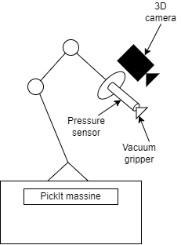
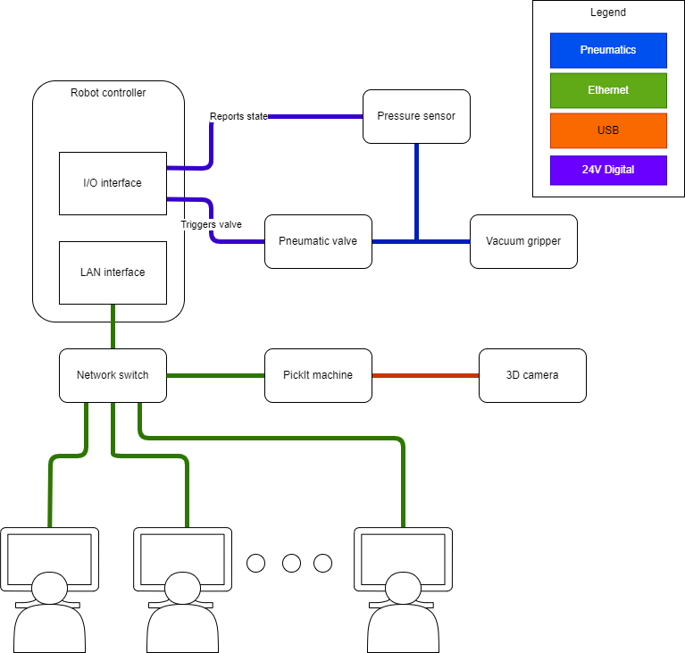

# Practical task with URKO

The practical task on the URKO robot consists of programming a bin picking and sorting application using a UR10 robot and an advanced 3D camera with localization software.

In this document you will find all the information you need to carry out the task.

## Equipment description and connection suggestion

The equipment you receive to carry out the application is as follows:

- Universal Robots UR10e robot
- 3D camera in the camera-in-hand configuration
- PickIt machine
- Vacuum gripper
- Pressure sensor

A schematics overview of these elements can be seen in the image below:

> **Important**: The PickIt machine is running ROS core! Therefore, it is important to set up the development computers accordingly!

In the next image, we will provide a connectivity overview:

## Software setup

[PickIt download page](https://docs.pickit3d.com/en/2.2/first-steps/downloads.html#downloads-ros)

## Task description

## Advanced

This section of the should be treated as an extra. Tackle it if you were really quick with the main part.

Your task is to mix a second item into the bin and program PickIt to detect both items.