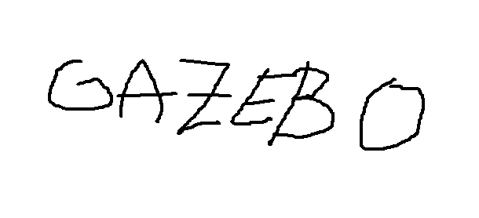

# Simulation

Welcome to the simulation part of the workshop.



We can do fancy math here!

$$
\pmb{\mathrm{\dot{x}}} = \pmb{\mathrm{J}} \pmb{\mathrm{\dot{q}}}
$$

We can also put practical code snippets:

```python
import rospy

if __name__ == "__main__:
    rospy.init_node('gazebo_tutorial')

    rospy.spin()

```