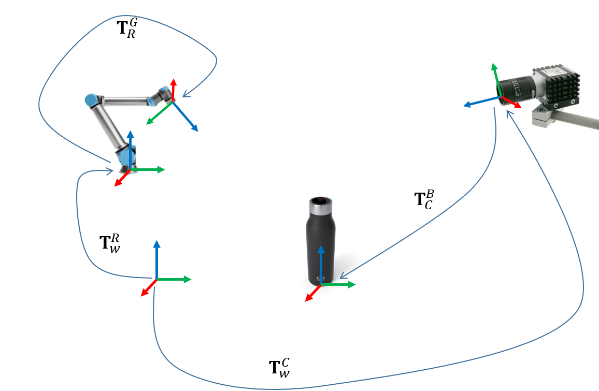

# Transformation and trajectory planning

Welcome to the part of the workshop where you will learn how to work with frame transformations and trajectory planning.



## Introduction 

At the end of this day you will be able to do the following:
* Write the relations between coordinate frames in a URDF file
* Publish custom transformation either from a Python script or command line
* Get the transformation between two arbitrary transforms
* Understand the relation between joint state publisher and robot state publisher
* Use Rviz to visualize the robot and the coordinate frames
* Use Rviz to plan a trajectory that brings the robot from one configuration to another whilst avoiding collisions 
* Use the MoveIt API to plan and execute robot trajectories
* Write a tool to save the current robot state - used for programming robot motions

## Transformations

In the first part of this day's workshop, we will learn how can we publish, read and visualize transformations.

### TF

From [TF's wiki page](http://wiki.ros.org/tf): 
> tf is a package that lets the user keep track of multiple coordinate frames over time.

In this part of the workshop, you will learn how we can use TF in practice and what needs to be taken care of.

### Where's the information

The transformation data between the various frames is available across two different topics: `/tf_static` and `/tf`.

As the name suggests, the `/tf_static` topic holds the transformation data between frames that are, well, static! Whereas `/tf` holds the transformation data between frames which relations change. Let's give it a try.

### Command line exercise

Open three terminals. In the first terminal, run the following command:
```
$ static_transform_publisher 0 0 1 0 0 0 world frame_1 1 
```

In the second terminal, run the following command:
```
$ static_transform_publisher 0 0 2 0 0 0 frame_1 frame_2  1 
```

Leave this two terminals open and switch to the third.

Let's inspect the content of the `/tf_static` topic:
```
$ rostopic echo /tf_static
```
What do you see?

Ok, now let's retrieve the transformation between `world` and `frame_2`. What do you expect to be the result?
```
rosrun tf tf_echo world frame_2
```

### Python exercise

Take the following code snipped and let's dig in:

```python
#!/bin/python
import rospy
import tf

rospy.init_node('publish_static_tf')

rospy.spin()
```

## A simple taste of URDF


## Robot state publisher

## Visualizing transforms in Rviz

## Assignment

At the end of this assignment you will have a set of tools that you can use during the practical part of the workshop. So do your best to make it as useful and easy-to-use as possible.

### First part of the assignment
Using the joint state publisher and a simulated robot save various joint and Cartesian space configurations into a YAML file

Example of YAML file obtained with this:
```yaml
```

### Second part of the assignment 
Using the YAML that you created in the first part of the assignment you will publish the message that were stored as `TransformStamped` onto TF.

Next, you will move the simulated robot into these configurations, joint and Cartesian space.

Example code that moves the robot into a joint space configuration that you previously called `home`:
```python
...
move_group.go(saved_configurations['home'])
...
```