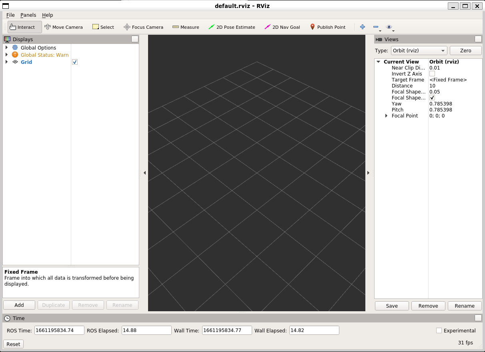
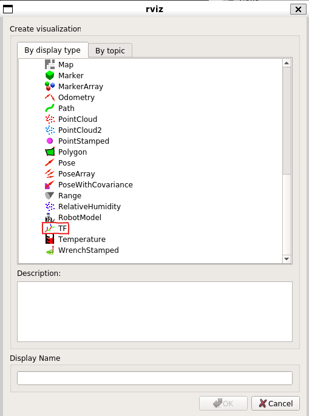
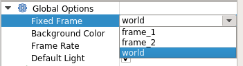
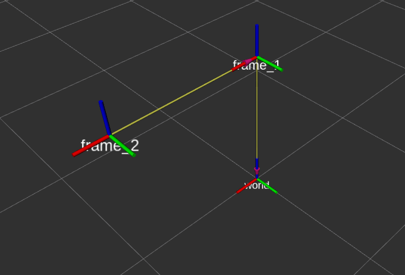

## Describing frame relations with URDF

There is another approach to describe relations between different coordinate frames that is not writing Python scripts. That is writing something called the Unified Robot Description Format -- URDF. This is representation of the robot model written in an XML format. In this part of the workshop, we will learn how how it is structured, its syntax and how it is used in practice.

### Simple URDF example

Let's take the following URDF and examine what we see:
```xml
<robot name="simple" xmlns:xacro="http://www.ros.org/wiki/xacro">
      <link name="world"/>
      <link name="frame_1"/>
      <joint name="world_frame_1_joint" type="fixed">
          <parent link="world"/>
          <origin xyz="0.0 0.0 1.0" rpy="0.0 0.0 0.0"/>
          <child link="frame_1"/>
      </joint>
</robot>
```

In the above URDF we are defining two links: `world` and `frame_1` (the `<link>` tag). We then define a `<joint>` tag that describes their relation: `frame_1` is offset from `world` by 1m along the `Z` axis.

With Python scripts it was easy -- we ran the script and we were able to observe this relations. Working with URDFs requires some extra steps.

Copy the content of the code snippet above and store it into a file called `two_frames.urdf`. Then, load this file onto the parameter server as `/robot_description`:
```
$ rosparam load two_frames.urdf /robot_description
```

Next, start something called the `robot_state_publisher` node (explanation follows):
```
$ rosrun robot_state_publisher robot_state_publisher
```

Open another terminal (or if you're a pro user put the `robot_state_publisher` into the background) and check if the transformation is present on TF with `tf_echo:
```
$ rosrun tf tf_echo world frame_1
At time 0.000
- Translation: [0.000, 0.000, 1.000]
- Rotation: in Quaternion [0.000, 0.000, 0.000, 1.000]
            in RPY (radian) [0.000, -0.000, 0.000]
            in RPY (degree) [0.000, -0.000, 0.000]
```
> **Question**: From which topic do you expect this data to come from, `/tf` or `/tf_static`? Hint: observe the attributes of the `<joint>` tag.

Terminate `tf_echo` and `robot_state_publisher` before continuing to the next section.
## Robot state publisher and the joint state publisher

What we observed in the demonstration above is how URDFs work in combination with the `robot_state_publisher`. The above example was for a `static` coordinate frame relation. As you are very well aware, robot manipulators are many things, static is not one of them. To help with this, URDF supports different types of attributes for the joint `type`. However, if we describe it as something different than static, we need another piece of information. Let's explore this.

```xml
<robot name="simple" xmlns:xacro="http://www.ros.org/wiki/xacro">
      <link name="world"/>
      <link name="frame_1"/>
      <link name="frame_2"/>
      <joint name="world_frame_1_joint" type="fixed">
          <parent link="world"/>
          <origin xyz="0.0 0.0 1.0" rpy="0.0 0.0 0.0"/>
          <child link="frame_1"/>
      </joint>
      <joint name="frame_1_frame_2_joint" type="revolute">
          <parent link="frame_1"/>
          <origin xyz="1.0 0.0 0.0" rpy="0.0 0.0 0.0"/>
          <axis xyz="0 0 1" />
          <child link="frame_2"/>
          <limit lower="-3.14" upper="3.14" effort="1" velocity="1"/>
      </joint>
</robot>
```
Similarly to before, save this into a file and load it onto the parameter server as `/robot_description`.

Once done, run the `robot_state_publisher` again.

We can now observe what's available on TF. We first confirm that the relation between `world` and `frame_1` still works:
```
$ rosrun tf tf_echo world frame_1
```
Since we also defined `frame_2`, we also expect it to be visible, right?
```
$ rosrun tf tf_echo frame_1 frame_2
Failure at 1661194747.531982600
Exception thrown:"frame_2" passed to lookupTransform argument source_frame does not exist.
The current list of frames is:
Frame frame_1 exists with parent world.
```
What's going on?

As we explained before, if we use a joint of a type different than `static`, we need another piece of information. That is, the value depending on the joint type. In our case we are dealing with `revolute` so we will need the angles for which the frame is turned around the joint.

There is a available in ROS to help us with that. It's called the `joint_state_publisher`. This program will read the contents of the `/robot_description` parameter and publish "some" joint values. Let's try it out to see how it works. Open a new terminal and run the following command
```
rosrun joint_state_publisher joint_state_publisher
```

In the other terminal use `tf_echo` to inspect the result:
```
rosrun tf tf_echo frame_1 frame_2
At time 1661195066.017
- Translation: [1.000, 0.000, 0.000]
- Rotation: in Quaternion [0.000, 0.000, 0.000, 1.000]
            in RPY (radian) [0.000, -0.000, 0.000]
            in RPY (degree) [0.000, -0.000, 0.000]
```

Tadaaah!

We can now modify the value of the joint by terminating `joint_state_publisher` and run `joint_state_publisher_gui` instead:
rosrun joint_state_publisher_gui joint_state_publisher_gui


Try moving the slider and observe the output of `tf_echo`.

Before moving to the next part, simply terminate `tf_echo`. Leave `robot_state_publisher` and `joint_state_publisher_gui` running.

## Visualizing transforms in Rviz

By now you are probably tired of observing numbers changing and want to see some action. In this section, we will have a quick look at Rviz - a tool for visualizing robots in ROS.

Let's give it a try by opening it:
```
$ rviz
```
You should be greeted by the following screen:


You are probably disappointed that you still don't see anything interesting. Bear with us. From here, click on the `Add` button on the bottom right. A new window should appear:


From the list select `TF` and click `Ok`.

In the last step, we need to tell Rviz which of the frames is our origin. From the drop-down menu under `Global Options` select `world`:



If you did everything correctly, you should now be able to see the three coordinate frames we described in the URDF:



<!-- To-do: load a proper robot's URDF and check the robot in RVIZ. Yes?-->